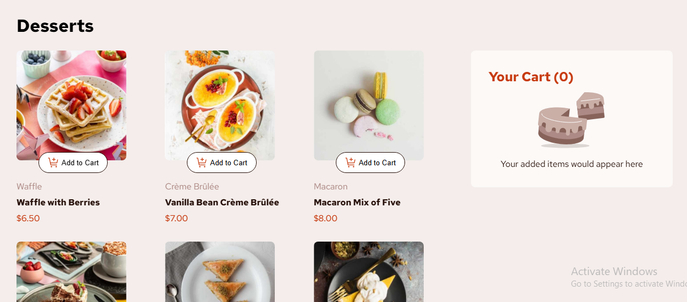

# Frontend Mentor - Product list with cart solution

This is a solution to the [Product list with cart challenge on Frontend Mentor](https://www.frontendmentor.io/challenges/product-list-with-cart-5MmqLVAp_d). Frontend Mentor challenges help you improve your coding skills by building realistic projects.

## Table of contents

- [Overview](#overview)
  - [The challenge](#the-challenge)
  - [Screenshot](#screenshot)
  - [Links](#links)
- [My process](#my-process)
  - [Built with](#built-with)
  - [What I learned](#what-i-learned)
  - [Continued development](#continued-development)
  - [Useful resources](#useful-resources)
- [Author](#author)

## Overview

### The challenge

Users should be able to:

- Add items to the cart and remove them
- Increase/decrease the number of items in the cart
- See an order confirmation modal when they click "Confirm Order"
- Reset their selections when they click "Start New Order"
- View the optimal layout for the interface depending on their device's screen size
- See hover and focus states for all interactive elements on the page

### Screenshot

### Links

- Solution URL: [Github || Solution Here](https://github.com/Yaseeru/Product-list-with-cart)
- Live Site URL: [Netlify || Live Url](https://product-list-with-card-solution.netlify.app/)

## My process

I started with creating the html structure and then and added the functionality in the script by dynamically displaying the items using the data.json provided and went ahead to style everything in my css. Pretty basic stuffs.

### Built with

- Semantic HTML5 markup
- CSS custom properties
- Flexbox
- JavaScript (Vanilla)
- Mobile-first workflow

### What I learned

Honestly, I didn't learn much because I have done projects similar to this in the past. I just used AI to improve my code a little, but I did everything on my own.

### Continued development

I would like to make more effort on the responsiveness; the responsiveness is okay but I believe it can be better.

### Useful resources

I didn’t use any tutorials or external resources for this project.

## Author

- Website - [Abdulhamid Abdullahi Sulaiman](https://abdulhamidsportfolio.netlify.app/)
- Frontend Mentor - [@Yaseeru](https://www.frontendmentor.io/profile/Yaseeru)
